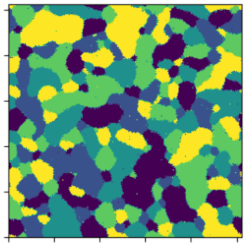
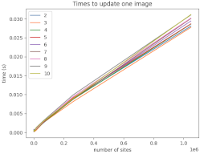
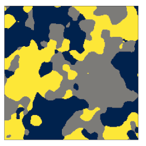

mrfx
====

Discrete Markov Random Fields (and more) with JAX for regular lattices (images). Getting the most of JAX for the computational tasks

:warning: Under heavy development. Check out the notebook

## Markov Random Fields





## Discrete Gaussian Unitary Simplex



# Documentation

# Contributing

* First fork the library.

* Then clone and install the library in development mode with

```bash
pip install -e .
```

* Install pre-commit and run it.

```bash
pip install pre-commit
pre-commit install
```

* Open a merge request once you are done with your changes.

# Citing

```
@article{courbot2025gaussian,
  title={Gaussian Unit-simplex Markov random fields as a fast proxy for MRF sampling},
  author={Courbot, Jean-Baptiste and Gangloff, Hugo},
  year={2025}
}
```
